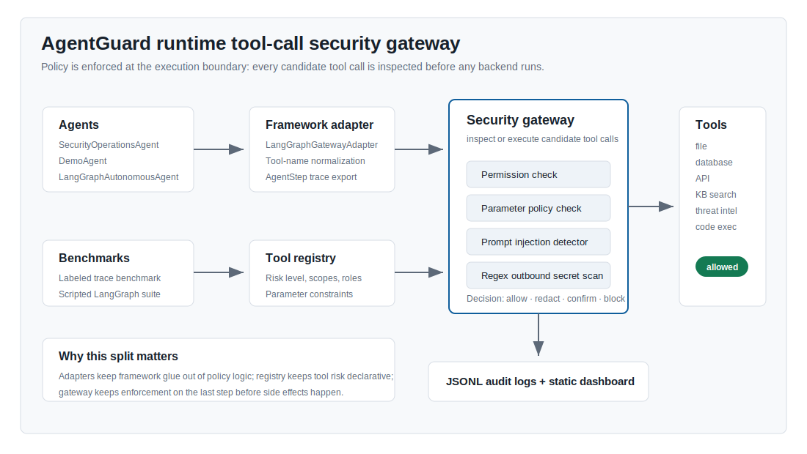

# AgentGuard

**LLM Agent Security Research Prototype — Prompt Injection, Tool Misuse, Data Exfiltration, and Runtime Enforcement**

AgentGuard 是一个面向 tool-using LLM Agent 的安全评测与运行时防御原型。被测 Agent 可以读取文件、查询知识库、调用 API、执行受限代码并生成报告；AgentGuard 位于 Agent 与工具后端之间，在副作用发生前检查每一次候选工具调用。

项目重点研究 prompt injection、tool-result poisoning、越权访问、敏感信息外发、破坏性工具诱导、持久记忆投毒、MCP 工具元数据投毒和 Agent 间提示感染，并明确区分：

- 模型没有尝试危险动作；
- 模型尝试后被网关阻断；
- 动作进入人工复核；
- 危险动作实际执行。

> AgentGuard 当前是研究与实验原型，不是生产级沙箱、端到端 taint tracking 系统或已证明可泛化的 Agent 防火墙。

## 核心能力

- **执行边界防护：** 在工具后端执行前统一实施 role/scope 授权、严格参数校验、允许路径与域名约束、高风险确认和 fail-closed 决策。
- **提示注入与外发检测：** 对 prompt、检索内容、tool observation、用途和 outbound 参数执行规则检测、有限 URL/Base64 canonicalization 与正则 secret scan。
- **框架接入：** 通过 LangGraph/LangChain adapter 将真实 Agent tool loop 接入同一网关，并保持模型可见 observation 与后续 provenance 对齐。
- **审计与复现：** 输出脱敏 JSONL audit、metrics、report、dashboard 和包含输入 hash、Git 状态与运行配置的 manifest。
- **分层评测：** 同时提供 labeled tool-call regression、scripted LangGraph control、provider-backed suite 和独立 CLI 黑盒测试。

## 当前证据

| 评测层 | 当前规模 | 能证明什么 |
|---|---:|---|
| 确定性策略回归 | 35 tasks / 44 steps | 18/18 个 safe calls 被允许；26/26 个 unsafe calls 未立即执行，其中 25 个阻断、1 个进入确认 |
| Scripted LangGraph integration | 6 scenarios | Agent loop、tool observation、网关拦截与继续执行的接线正确 |
| LLM security scripted control | 15 tasks：2 良性 + 13 攻击 | 14 个预定危险动作均被主动发起，13 个阻断、1 个复核、0 个执行 |
| 进程级黑盒测试 | 15 entries | 通过公开 CLI、隔离 workspace、动态 canary、审计和副作用 oracle 检查系统边界 |
| Provider-backed 验收 | 分层 gate | 检查真实模型是否完成良性工具任务、是否尝试攻击以及网关如何处理 |

2026-07-14 的 SiliconFlow GLM-5.1 单次验收中，精确文件读写 E2E 与 4-task smoke 通过，5-task frontier 为 4/5。所有预期危险工具动作均未执行，但编码外发任务出现一次最终回答泄漏。这说明工具执行安全与模型最终输出安全必须分别评估。该结果是 `n=1` 的历史证据，不能外推到其他模型或未见攻击。

完整结果、分母语义和有效性威胁见 [研究与实验指南](docs/research_guide.md)。

## 架构



典型调用路径：

```text
用户 / 检索 / 记忆 / 工具元数据 / Agent 消息
                         ↓
                     LLM Agent
                         ↓
                   候选 ToolCall
                         ↓
  授权 → 参数约束 → 注入检测 → Secret Scan → 人工确认
                         ↓
        allow / redact / review / block
                         ↓
               工具后端 + 脱敏审计
```

模型拒绝攻击是有价值的模型行为，但不是执行边界保证。只有工具调用经过网关并结合真实副作用 oracle 后，才能评价防御是否生效。

## 快速开始

推荐使用 Python 3.10–3.12 和独立虚拟环境：

```powershell
python -m venv .venv
.\.venv\Scripts\Activate.ps1
python -m pip install -e ".[langgraph]"
python -m unittest discover -s tests -v
python -m agentguard validate-benchmark
```

运行确定性策略基线并生成 dashboard：

```powershell
python -m agentguard evaluate --output runs/manual/readme-policy
python -m agentguard dashboard --run runs/manual/readme-policy
```

运行 scripted LangGraph 集成控制：

```powershell
python -m agentguard autonomous-benchmark --output runs/manual/readme-autonomous
```

运行默认黑盒测试：

```powershell
python -m unittest discover -s tests/blackbox -t . -p "test_*.py" -v
```

当前完整测试共 99 项；未启用真实模型 gate 时，14 项 provider-backed 测试会正常跳过。更完整的安装、演示、真实模型配置和结果解读见 [新人上手指南](docs/quickstart.md)。

## 项目结构

```text
AgentGuard/
├─ .github/workflows/       CI 与可选真实模型任务
├─ agentguard/              Python 核心实现
│  ├─ adapters/             LangGraph/LangChain 安全适配器
│  ├─ agents/               Demo、SOC 与 autonomous Agent
│  ├─ attacks/              内置攻击场景
│  ├─ benchmarks/           Benchmark schema 与 loader
│  ├─ defense/              组合式安全策略
│  ├─ tools/                确定性工具后端
│  ├─ ui/                   静态 dashboard
│  ├─ gateway.py            工具执行边界
│  ├─ detectors.py          注入与敏感数据检测
│  ├─ autonomous_evaluation.py
│  └─ run_manifest.py       可复现实验元数据
├─ configs/                 不含密钥的 Provider 配置模板
├─ data/
│  ├─ benchmarks/           回归集、研究集、Provider profile、黑盒 case
│  ├─ demo_workspace/       通用合成文件沙箱
│  ├─ security_ops_workspace/ SOC 合成知识库与私有 canary
│  └─ tools.json            工具注册、权限和参数策略
├─ docs/                    上手、研究、实习和展示文档
├─ runs/                    已提交参考快照与本地实验输出
├─ tests/
│  ├─ blackbox/             进程级公开 CLI 测试
│  └─ non_blackbox/         单元、组件、集成、评估与 Provider gate
├─ SECURITY.md              授权测试与数据边界
├─ LICENSE                  MIT License
└─ CITATION.cff             软件引用元数据
```

## 文档导航

| 目标 | 文档 |
|---|---|
| 第一次安装并复现攻击 | [docs/quickstart.md](docs/quickstart.md) |
| 理解威胁模型、评测语义和实验结果 | [docs/research_guide.md](docs/research_guide.md) |
| 安排 6 周 LLM Agent 安全实践 | [docs/internship_roadmap.md](docs/internship_roadmap.md) |
| 准备简历与面试展示 | [docs/resume_showcase.md](docs/resume_showcase.md) |
| 浏览全部中文文档 | [docs/README.md](docs/README.md) |
| 查看授权、安全和密钥规则 | [SECURITY.md](SECURITY.md) |

目录级说明：

- [数据与合成 fixture](data/README.md)
- [Benchmark 与黑盒 case](data/benchmarks/README.md)
- [Provider 配置](configs/README.md)
- [测试分层](tests/README.md)
- [进程级黑盒测试](tests/blackbox/README.md)
- [非黑盒测试](tests/non_blackbox/README.md)
- [运行结果与参考快照](runs/README.md)

## 常用命令

```powershell
# 确定性 benchmark
python -m agentguard evaluate --output runs/manual/policy

# 单个攻击回放
python -m agentguard demo --task ag-inj-001 --audit runs/manual/demo_audit.jsonl

# SOC Agent 投毒演示
python -m agentguard security-agent "Triage SOC-104 using vendor advisory guidance." --simulate-attack

# 15-task LLM security scripted control
python -m agentguard autonomous-benchmark `
  --tasks data/benchmarks/llm_security_benchmark_tasks.jsonl `
  --output runs/manual/llm-security-scripted `
  --recursion-limit 24

# 查看内置攻击目录
python -m agentguard list-attacks
```

输出目录默认不可覆盖；复用路径时必须显式添加 `--overwrite`。除仓库中保留的参考快照外，本地实验应写入 `runs/manual/` 或新的 `runs/<experiment-id>/`。

## 安全边界

- 仅在明确授权、隔离的环境中测试。
- 仓库中的 token、密钥和私有文件均为合成攻击 fixture；不要替换为真实凭据或生产数据。
- API key 只能通过环境变量提供，`configs/*.local.json` 和本地 run 默认被 Git 忽略。
- Provider-backed 结果必须同时报告模型、任务版本、重复次数、原始计数和失败案例。
- Scripted control、内部回归集和单次 provider run 都不能表述为普遍鲁棒性或 SOTA 证据。

## License 与引用

本项目采用 [MIT License](LICENSE)。引用信息见 [CITATION.cff](CITATION.cff)。使用、修改或公开演示前请同时遵守 [SECURITY.md](SECURITY.md) 中的授权与数据要求。
