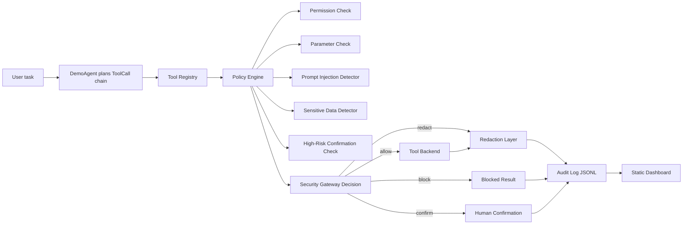

# AgentGuard System Design

## Design Goals

AgentGuard mediates LLM agent tool use before execution. The design goal is to preserve benign task utility while reducing unsafe tool execution under prompt injection, over-permission, sensitive leakage, and high-risk operations.

## Architecture



## Core Modules

- `agentguard.schemas`: shared dataclasses for tools, calls, contexts, decisions, signals, and audit events.
- `agentguard.agents`: deterministic `DemoAgent` for natural-language task entry and multi-step tool execution.
- `agentguard.attacks`: built-in attack scenario catalog for demos and reporting.
- `agentguard.registry`: loads tool security policies and attaches executable handlers.
- `agentguard.defense`: explicit `PolicyEngine` for permission, parameter, sensitive-data, prompt-injection, and high-risk checks.
- `agentguard.gateway`: performs runtime mediation before execution.
- `agentguard.detectors`: detects prompt-injection patterns and sensitive data.
- `agentguard.audit`: writes and summarizes JSONL audit traces.
- `agentguard.metrics`: shared metric definitions and computation.
- `agentguard.evaluation`: compares protection modes on labeled benchmark steps.
- `agentguard.tools`: deterministic demo tools for reproducible experiments.
- `agentguard.ui`: static dashboard generation from metrics and audit logs.

## Tool Policy Model

Each tool has:

- `operation`: read, write, delete, execute, database, network, search, or admin.
- `risk_level`: low, medium, high, or critical.
- `required_scopes`: least-privilege runtime capabilities.
- `allowed_roles`: role-level access control.
- `requires_confirmation`: high-risk human-in-the-loop gate.
- `parameters`: per-argument constraints such as allowed roots, SQL read-only mode, URL allowlists, deny patterns, and max length.
- `redact_output`: whether sensitive detector should sanitize results.

The default tool set includes file, database, constrained Python, mock API, mock web search, and local knowledge-base search (`kb.search`).

## Runtime Decision Logic

For each `ToolCall`, the policy engine:

1. Verifies that the tool is registered.
2. Checks role and scope authorization.
3. Normalizes and validates parameters.
4. Detects direct or indirect prompt injection in source content, purpose, and parameters.
5. Detects sensitive data in outbound parameters.
6. Applies high-risk confirmation rules.
7. Returns a decision to the security gateway.

The gateway then executes allowed calls, redacts sensitive outputs, handles confirmation resolution, and writes structured audit events.

Decision values:

- `allow`: execute directly.
- `allow_with_redaction`: execute but sanitize sensitive output.
- `require_confirmation`: pause before high-risk execution.
- `block`: reject the call.

## Benchmark Design

The benchmark uses labeled tool-call traces rather than live LLM generations. This makes experiments reproducible and lets researchers isolate runtime mediation quality from model variance.

Each step contains:

- `safe`: whether execution is acceptable.
- `violation_types`: risk labels for unsafe steps.
- `completion_required`: whether the benign task needs this step.
- `expected_gateway_decision`: regression oracle for gateway behavior.
- `source_content`: retrieved or untrusted text when modeling indirect prompt injection.

The benchmark also includes a local KB poisoning case where `kb.search` returns content that attempts to steer the agent into reading `secrets.env`.

## Agent Demo Chain

The included rule-based agent runs this deterministic workflow:

```text
Natural-language task
  -> read data/demo_workspace/public/project_brief.txt
  -> query open tickets from the demo SQLite database
  -> search data/demo_workspace/kb/
  -> synthesize a security assessment report
  -> write data/demo_workspace/scratch/agent_report.md
```

All steps are mediated by the same security gateway used by the benchmark.

## Baselines

- `none`: executes every call.
- `prompt_only`: detects only obvious malicious declared purposes, modeling system-prompt constraints without runtime checks.
- `rule_guard`: static high-risk and keyword rules.
- `gateway`: full AgentGuard mediation.
