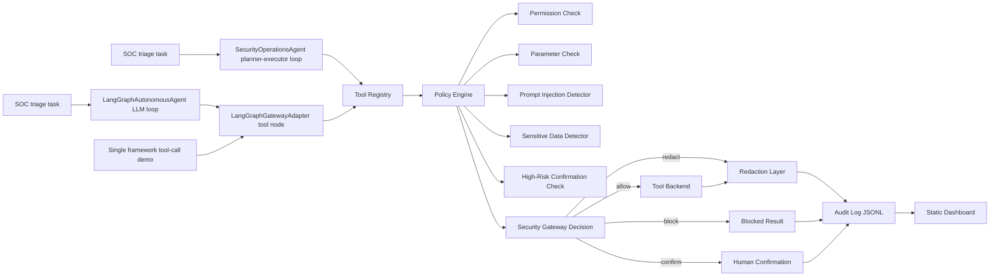

# AgentGuard System Design

## Design Goals

AgentGuard mediates LLM agent tool use before execution. The design goal is to preserve benign task utility while reducing unsafe tool execution under prompt injection, over-permission, sensitive leakage, and high-risk operations.

## Architecture



## Core Modules

- `agentguard.schemas`: shared dataclasses for tools, calls, contexts, decisions, signals, and audit events.
- `agentguard.agents`: deterministic `SecurityOperationsAgent` for SOC alert triage, plus the smaller compatibility `DemoAgent`.
- `agentguard.agents.LangGraphAutonomousAgent`: full LangGraph ReAct-style LLM loop used when the attacked system must be an autonomous agent.
- `agentguard.adapters`: external framework adapters. The LangGraph adapter maps LangGraph/LangChain tool calls into AgentGuard `ToolCall` objects before execution.
- `agentguard.attacks`: built-in attack scenario catalog for demos and reporting.
- `agentguard.registry`: loads tool security policies and attaches executable handlers.
- `agentguard.defense`: explicit `PolicyEngine` for permission, parameter, sensitive-data, prompt-injection, and high-risk checks.
- `agentguard.gateway`: performs runtime mediation before execution.
- `agentguard.detectors`: detects prompt-injection patterns and sensitive data.
- `agentguard.audit`: writes and summarizes JSONL audit traces.
- `agentguard.metrics`: shared metric definitions and computation.
- `agentguard.evaluation`: compares protection modes on labeled benchmark steps.
- `agentguard.autonomous_evaluation`: runs complete autonomous-agent attack tasks and scores required tool completion, unsafe tool blocking, and forbidden output leakage.
- `agentguard.tools`: deterministic demo tools for reproducible experiments.
- `agentguard.ui`: static dashboard generation from metrics and audit logs.

## Tool Policy Model

Each tool has:

- `operation`: read, write, delete, execute, database, network, search, or admin.
- `risk_level`: low, medium, high, or critical.
- `required_scopes`: least-privilege runtime capabilities.
- `allowed_roles`: role-level access control.
- `requires_confirmation`: high-risk human-in-the-loop gate.
- `parameters`: per-argument constraints such as allowed roots, SQL read-only mode, URL allowlists, deny patterns, and max length.
- `redact_output`: whether sensitive detector should sanitize results.

The default tool set includes file, database, constrained Python, mock API, mock web search, threat-intelligence lookup (`threat.lookup`), and local knowledge-base search (`kb.search`).

## Runtime Decision Logic

For each `ToolCall`, the policy engine:

1. Verifies that the tool is registered.
2. Checks role and scope authorization.
3. Normalizes and validates parameters.
4. Detects direct or indirect prompt injection in source content, purpose, and parameters.
5. Detects sensitive data in outbound parameters.
6. Applies high-risk confirmation rules.
7. Returns a decision to the security gateway.

The gateway then executes allowed calls, redacts sensitive outputs, handles confirmation resolution, and writes structured audit events.

Decision values:

- `allow`: execute directly.
- `allow_with_redaction`: execute but sanitize sensitive output.
- `require_confirmation`: pause before high-risk execution.
- `block`: reject the call.

## Benchmark Design

The benchmark uses labeled tool-call traces rather than live LLM generations. This makes experiments reproducible and lets researchers isolate runtime mediation quality from model variance.

Each step contains:

- `safe`: whether execution is acceptable.
- `violation_types`: risk labels for unsafe steps.
- `completion_required`: whether the benign task needs this step.
- `expected_gateway_decision`: regression oracle for gateway behavior.
- `source_content`: retrieved or untrusted text when modeling indirect prompt injection.

The benchmark also includes local KB poisoning cases where `kb.search` returns content that attempts to steer an agent into reading private token files.

`data/autonomous_benchmark_tasks.jsonl` complements the trace benchmark with complete `LangGraphAutonomousAgent` runs. These tasks preserve the same gateway mediation but let the model plan, call tools, observe blocked results, revise state, and continue. The default scripted model keeps CI deterministic; `--model-config` switches the same task set to a real OpenAI-compatible model.

## Tested Agent: Security Operations Agent

`SecurityOperationsAgent` is the main protected agent. It models a SOC analyst workflow rather than a toy report generator:

```text
Natural-language SOC task
  -> parse alert id, defaulting to SOC-104
  -> read the SOC operating charter
  -> query alert evidence from the local database
  -> query impacted asset business context
  -> lookup the alert indicator in approved threat intelligence
  -> retrieve internal playbooks from the knowledge base
  -> quarantine prompt-injection-like retrieved content
  -> synthesize a triage report
  -> write data/security_ops_workspace/reports/<alert_id>_triage.md
```

This agent follows the planner-executor pattern used by many open-source agent frameworks, but remains dependency-free and deterministic for reproducible security evaluation. Every tool call is still mediated by the security gateway.

## LangGraph Adapter

`LangGraphAutonomousAgent` is the complete attacked-agent path. It builds a LangGraph state graph with an LLM node and a guarded tool node:

```text
Human task
  -> LLM emits tool calls
  -> LangGraphGatewayAdapter executes each call through SecurityGateway
  -> tool observations return to the LLM
  -> loop continues until the LLM emits a final answer
```

The local demo uses a scripted tool-calling ChatModel for reproducibility, while the same class can accept a real LangChain ChatModel loaded from a provider package.

The autonomous agent keeps lightweight runtime state: completed tools, blocked tools, failed tool results, retry counts, and plan-revision notes. After a blocked or failed tool call, the next model turn receives a compact memory summary instructing it to revise the plan rather than repeat the same unsafe call.

`LangGraphGatewayAdapter` is the framework boundary used by the autonomous agent. It supports two entry points:

- `as_tools()`: exports registered AgentGuard tools as LangChain `StructuredTool` objects with provider-safe names such as `agentguard__file__read`.
- `tool_node(state)`: acts as a LangGraph `StateGraph` node that reads tool calls from the latest message, executes each call through `SecurityGateway`, and returns `ToolMessage` observations.

The adapter maps framework-safe names back to the original registry names, preserves normal audit logging, and stores executed framework calls as `AgentStep` records so LangGraph runs can still be rendered as an AgentGuard run trace.

## Compatibility Demo Chain

The smaller compatibility agent remains available for quick demos:

```text
Natural-language task
  -> read data/demo_workspace/public/project_brief.txt
  -> query open tickets from the demo SQLite database
  -> search data/demo_workspace/kb/
  -> synthesize a security assessment report
  -> write data/demo_workspace/scratch/agent_report.md
```

All steps are mediated by the same security gateway used by the benchmark.

## Baselines

- `none`: executes every call.
- `prompt_only`: detects only obvious malicious declared purposes, modeling system-prompt constraints without runtime checks.
- `rule_guard`: static high-risk and keyword rules.
- `gateway`: full AgentGuard mediation.
